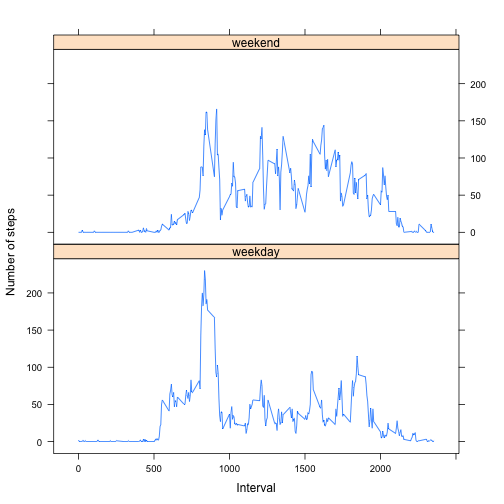

## Loading and preprocessing the data

```r
activity<-read.csv("activity.csv")
activity.valid<-subset(activity,!is.na(activity$steps))
```


## What is mean total number of steps taken per day?
[1] Create histogram of total number of steps taken per day

```r
activity.total <- aggregate(activity.valid$steps,by=list(activity.valid$date),sum)
colnames(activity.total)<-c("date","steps")
hist(activity.total$steps,main="Histogram of total steps taken per day",xlab="Total steps taken per day")
```

 

[2] Calculate mean and median of total number of steps taken per day

```r
mean.total.steps <- as.integer(mean(activity.total$steps))
```
Mean total number of steps taken per day: 10766


```r
median.total.steps <- as.integer(median(activity.total$steps))
```
Median total number of steps taken per day: 10765

## What is the average daily activity pattern?
[1] Plot average number of steps vs 5-minute interval

```r
activity.avg <- aggregate(activity.valid$steps,by=list(activity.valid$interval),mean)
colnames(activity.avg)<-c("interval","steps")
plot(activity.avg,type="l",main="Average number of steps vs 5-minute interval", ylab="Average number of steps",xlab="5-minute interval")
```

 

```r
interval.max.steps <- subset(activity.avg$interval,activity.avg$steps == max(activity.avg$steps))
```

[2] The 5-minute interval containing the maximum number of average steps is: 835

## Imputing missing values

```r
activity.na<-subset(activity,is.na(activity$steps))
num.missing.values <- nrow(activity.na)
```
[1] Total number of missing values in dataset: 2304

[2] Remove "steps" columns from data frame "activity.na". Using data frame "activity.avg" which contains the average number of steps taken for each interval average over all days, merge with data frame "activity.na" (which contains missing values) using "interval" as the common column to produce data frame "activity.filled".Combined the rows of data frame "activity.valid" to "activity.filled" so that we have a complete data frame with missing values replaced with average values. 
   
[3] Create new data frame with missing values replaced with mean values

```r
activity.na$steps<-NULL
activity.filled <- merge(activity.avg,activity.na,by="interval")
activity.filled$steps <- as.integer(activity.filled$steps)
activity.filled <- data.frame(activity.filled$steps,activity.filled$date,activity.filled$interval)
colnames(activity.filled) <- colnames(activity)
activity.filled <- rbind(activity.valid,activity.filled)
```

[4] Create histogram

```r
activity.filled.total <- aggregate(activity.filled$steps,by=list(activity.filled$date),sum)
colnames(activity.filled.total)<-c("date","steps")
hist(activity.filled.total$steps,main="Histogram of total steps taken per day",xlab="Total steps taken per day")
```

 


```r
new.mean.total.steps<-as.integer(mean(activity.filled.total$steps))
```
New mean total steps per day: 10749

```r
new.median.total.steps<-as.integer(median(activity.filled.total$steps))
```
New median total steps per day: 10641 

The new mean and median values for the total number of steps taken per day are less than the estimates from the first part of the assignment.

## Are there differences in activity patterns between weekdays and weekends?
[1] Insert a new factor column of values "weekend" and "weekday"

```r
day <- weekdays(as.Date(activity.filled$date))
activity.pattern <- cbind(activity.filled,day)
activity.pattern$day<-gsub("Tuesday|Monday|Wednesday|Thursday|Friday","weekday",activity.pattern$day)
activity.pattern$day<-gsub("Saturday|Sunday","weekend",activity.pattern$day)
activity.pattern$day<- factor(activity.pattern$day)
```

[2] Make a panel plot

```r
activity.pattern<-aggregate(activity.pattern$steps,by=list(activity.pattern$interval,activity.pattern$day),mean)
colnames(activity.pattern)<- c("interval","day","steps")
activity.pattern$steps <- as.integer(activity.pattern$steps)
library(lattice)
xyplot(activity.pattern$steps~activity.pattern$interval|activity.pattern$day,layout=c(1,2),type="l",xlab="Interval",ylab="Number of steps")
```

 
